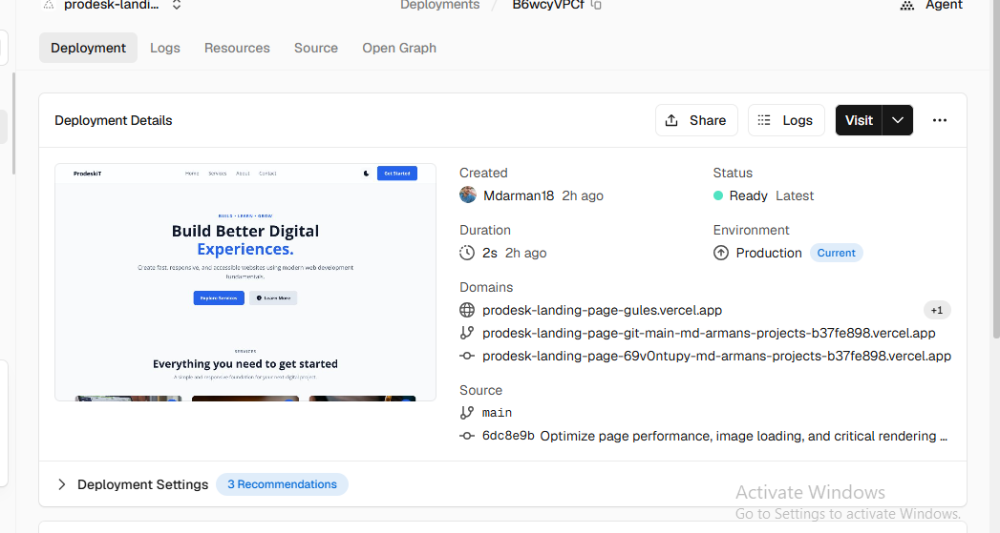

# ProdeskiT - Modern Landing Page

A fast, responsive and accessible landing page for **ProdeskiT**, built with plain HTML, CSS and vanilla JavaScript. No frameworks, no build step.

**Live site:** https://prodesk-landing-page-gules.vercel.app


---

## Features

- **Fully responsive** layout for desktop, tablet and mobile
- **Dark mode toggle** with an animated sun/moon icon
- **Mobile hamburger menu** that closes automatically when a link is clicked
- **Performance focused**
  - Critical CSS preloaded to reduce render-blocking
  - LCP image preloaded with `fetchpriority="high"`
  - Modern **AVIF** images with explicit `width` and `height` (no layout shift)
  - Below-the-fold images use `loading="lazy"`
- **Accessible**
  - Semantic HTML (`header`, `nav`, `main`, `section`, `article`, `footer`)
  - ARIA attributes on the theme and menu toggles
  - Keyboard-friendly controls
- **Inline SVG icons**, so there are no icon libraries or extra requests
- **SEO ready** with a meta description and a proper heading structure

## Sections

| Section | Description |
|---|---|
| Home | Hero with headline and call-to-action buttons |
| Services | Three cards: Fast Performance, Responsive Design, Accessible |
| About | Short intro about the company and approach |
| Contact | Get started call-to-action with contact and download buttons |

## Tech Stack

- **HTML5** for structure
- **CSS3** for layout and styling (`index.css`)
- **Vanilla JavaScript** for the theme toggle and mobile menu (inline in `index.html`)
- **Vercel** for hosting and deployment

## Project Structure

```
prodesk-landing-page/
├── index.html
├── index.css
├── image/
│   ├── photo1.avif
│   ├── photo2.avif
│   └── photo3.avif
├── screenshots/
│   └── preview.png
└── README.md
```

## Getting Started

No installation needed. Just clone the repo and open it in a browser.

```bash
# 1. Clone the repository
git clone https://github.com/Mdarman18/prodesk-landing-page.git

# 2. Go to the project folder
cd prodesk-landing-page

# 3. Open index.html in your browser
```

Or run a local server (optional):

```bash
# Using VS Code: install the "Live Server" extension, then right-click index.html > Open with Live Server

# Or with Node.js
npx serve .
```
Performance

Performance was an important part of this project. I tested the deployed website using Google Lighthouse and optimized the page for loading speed, accessibility, best practices, and SEO.

Lighthouse Performance Report :- 

The performance optimization included:

Preloading critical resources
Prioritizing the LCP image using fetchpriority="high"
Using AVIF image formats
Defining image width and height
Lazy-loading below-the-fold images
Using inline SVG icons instead of an external icon library
Reducing unnecessary external requests
Optimizing the page structure and assets

Performance Screenshot: 
## Deployment

This project is deployed on **Vercel** and connected to the `main` branch. Every push to `main` triggers an automatic production deployment.

To deploy your own copy:

1. Fork or clone this repository
2. Sign in to [Vercel](https://vercel.com) and click **Add New > Project**
3. Import the repository
4. Keep the defaults (no build command needed) and click **Deploy**

## Customization

- **Colors, fonts and spacing:** edit `index.css`
- **Text and sections:** edit `index.html`
- **Images:** replace the files in `image/` and keep the `width` and `height` attributes in sync with the new image size
- **Contact email:** change the `mailto:hello@example.com` link in the Contact section

## Author

**Md Arman**
GitHub: [@Mdarman18](https://github.com/Mdarman18)
